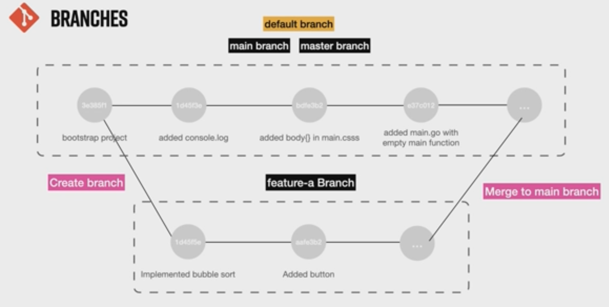
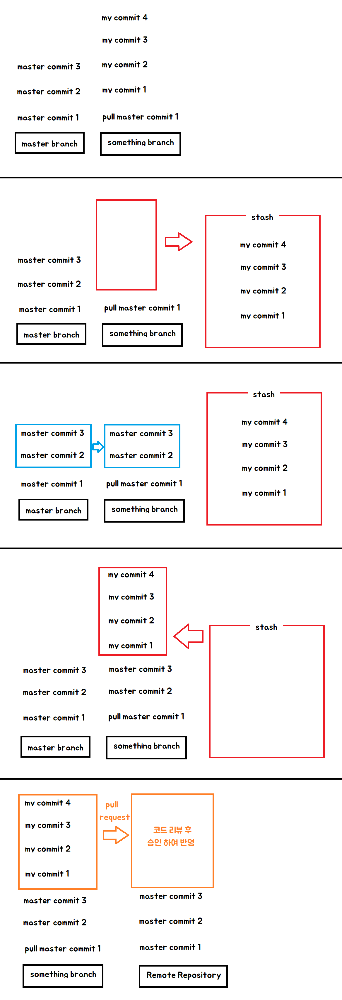
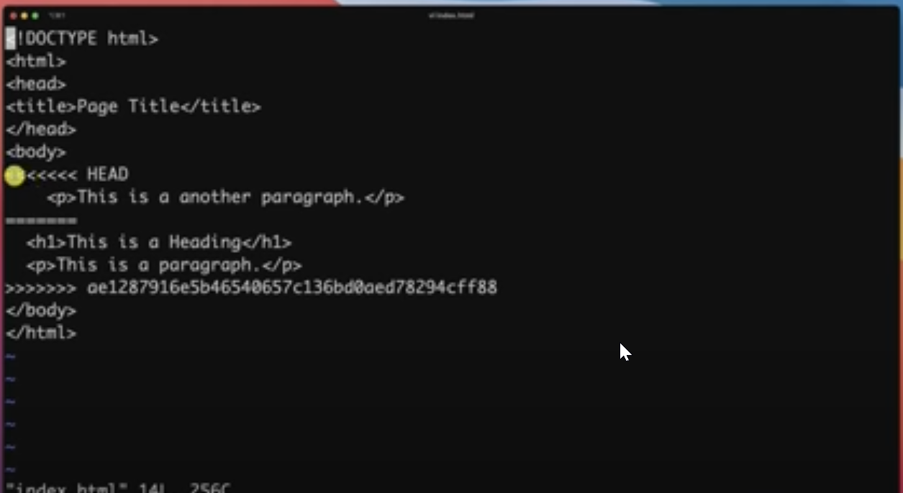

# 📌 읽기전
1. {xxx} 는 argument 입니다
2. [xxx] 는 생략 가능 argument 입니다

 

## 📌 깃 관리 영역
`working directory > stage > local repository > remote repository`

`작업 디렉토리 > 스테이지 > 로컬 저장소 > 원격 저장소`

   

##  📌 깃 버전 보기
`git --version`

 

## 📌 깃 Bash 창 내용 지우기
`clear` or `ctrl + l`  

 

## 📌 깃 콘픽 설정 하기
`git config --global user.name "이름"`  
`git config --global user.email "이메일"`  
`git config --global color.ui auto`

 

## 📌 깃 콘픽 설정 보기
`git config -l`

 

## 📌 디렉토리 생성
`mkdir 파일명`

 

## 📌 디렉토리 보기
`ls` : 파일 보기 (.git 디렉토리 안보임)

`ls -a` : 모든 파일 보기

 

## 📌 깃 시작 하기
`git init`

 

## 📌 깃 제거 하기
`rm -rf .git`

`rm -rf {파일 또는 디렉토리}` : 묻지 않고 바로 제거

 

## 📌 파일 생성 하기
`touch {파일명}`

 ex) `touch index.html`

 

## 📌 깃 현재 상태 보기
`git status` : branch, untracked,  new file, modified, deleted 등 정보를 알 수 있다

`branch` : 브랜치 정보  
`untracked` : `working directory` 에 있는 파일 (한 번도 `add` 가 되지 않은 파일)  
`new file` : `working directory` 에서 `add` 를 통행 `stage` 로 넘어온 파일  
`modified` : 한 번 `commit` 되고 나서 수정 된 경우  
`deleted` : `stage` 또는 `local repository` 에서 삭제된 경우

 

## 📌 깃 추가하기 <small>working directory -> stage</small>
`git add {파일명}` : `working directory` 의 해당 파일을 `stage` 에 이동

`git add .` : 현재 디렉토리의 `working directory` 의 파일을 모두 `stage` 에 이동

`git add -A` or `git add --all` : `working directory` 의 파일을 모두 `stage` 에 이동

 

## 📌 깃 커밋하기 <small>stage -> local repository</small>
`git commit -m "{메시지}"`

 

`create mode` : 파일이 `local repository` 생성 됨을 알리는 로그

 

## 📌 깃 로그 보기
`git log`

 

`commit a0ac7dfc1848b31e96878812df17661b2b7d74a2`  
: 커밋 해시 (주소번지) - 나중에 돌아갈 때 커밋해시를 통해서 합니다

`Author: hbh <sout1217@naver.com>`  
: 위에서 작성한 `git config --global user.name 과 user.email`  내용으로 작성 됩니다

`init commit`  
: `git commit -m {메시지}` 커밋 메시지 내용입니다

 

## 📌 깃 보기
`git show {커밋해시}`

 

> TIP : 내용이 긴 경우 엔터를 쳐서 확장이 가능하며, 더 이상 안보려면 q 를 누르면 빠져나옵니다

 

## 📌  파일 편집하기
`vi {파일명}` : 파일 에디터 실행

 

> TIP : vi 를 입력 후 `shift + tab` 을 누르시면 파일 목록이 나타납니다

 

`i` : 작성모드  
`esc` : 명령모드  
`[명렴모드] :wq!` : 저장하고 파일 닫기   
`[명렴모드] :q!` : 저장하지 않고 파일 닫기 

 

## 📌 파일 내용 보기
`cat {파일명}` : 파일 내용 보기

 

 

## 📌 이전 커밋과 다른 점 비교하기
`git diff`

 

 
 
 `+console.log('Hello Git')` : + 내용이 추가 됨
 `-console.log('Hello Git')` : - 내용이 삭제 됨

 

## 📌 최근에 커밋된 메시지 내용 수정하기
`git commit --amend [-m] "{메시지}"`

 

 

`git log` 를 이용하여 메시지 내용이 변경된 것을 확인한다

 

## 📌 깃 허브(Git-Hub)에 프로젝트 업로드하기 설정 <small>(local repository -> remote repository)</small>
- 깃 허브 계정이 있어야 가능합니다
- 깃 허브에서 remote repository 생성은 생략합니다 (보통 local repository 에서 remote repository 로 업로드 합니다)

`git remote add origin {깃헙주소}`  
ex) `git remote add origin https://github.com/sout1217/sample.git`

 

`git push -u -origin {마스터명}` : 위 에서 `git remote add` 로 연결한 `remote repository` 에 파일을 업로드 합니다

> TIP : remote repository 에 push 하기 위해서는 `git-hub>SSH and GPG keys>SSH keys>generating SSH keys>Generating a new SSH key and adding it to the ssh-agent>Windows ` 에서 인증을 받아야 합니다  
>
> `ssh-keygen -t ed25519 -C "{이메일}"` 비밀번호는 작성안해도 가능합니다   
> `eval "$(ssh-agent -s)"`  
> `vi ~/.ssh/config`
> `Host * AddKeysToAgent yes UseKeychain yes IdentityFile ~/.ssh/id_ed25519`  
> `ssh-add -K ~/.ssh/id_ed25519`
> `cat ~/.ssh/id_ed25519.pub` : 나오는 키를 복사 `pbcopy < ~/.ssh/id_ed25519.pub` 로 복사 가능
> `git hub > New SSH key` 클릭 후 `id_ed25519.pub` 키를 붙여넣기

  

## 📌 깃 마스터 브랜치명 변경 및 브랜치 리스트 조회하기
`git branch -M {마스터명}` : 마스터명을 바꿉니다

`git branch` : 현재 존재하는 브랜치 목록들을 보여줍니다 

 

## 📌 깃 허브(Git Hub)에 업로드
`git push [-u origin {마스터명}]` : remote repository 와 연결이 되야 가능합니다

 

## 📌 깃 허브(Git Hub) 코드 다운로드
`git pull`

> TIP : `git pull` 은 `git fetch + git merge` 개념이라고 보면 된다

 

## 📌 브랜치 관리

`git branch` : 로컬 저장소 브랜치 목록 보기

`git branch -r` : 원격 저장소 브랜치 목록 보기

`git branch -a` : 로컬 저장소, 원격 저장소 브랜치 목록 보기

 

## 📌 브랜치 만들기
`git branch {브랜치명}`  
ex) `git branch feature-a`

> TIP : 현재 브랜치가 가지고 있는 파일로 새로운 브랜치를 생성합니다

- master 브랜치는 a,b,c 파일을 갖고 있으며,
- develop 브랜치는 a, b, c , d 파일을 갖고 있으며,
- feature 브랜치는  a, b, c, d, e 파일을 갖고 있다고 가정한다면
- master 브랜치에서 새로운 브랜치를 생성하면 a,b,c 를 갖고,
- feature 브랜치에서 새로운 브렌치를 생성하면 a, b, c, d, e 파일을 갖고 있는다

 
 
## 📌 다른 브랜치로 변경하기
`git checkout {브랜치명}` : 해당 브랜치로 변경합니다

`git checkout -` : 이전 브랜치로 변경합니다

 

## 📌 생성한 브랜치에서 원격 저장소에 업로드하기 (something branch local repository -> remote repository)
`git push -u origin {해당 브랜치명}` or `git push --set-upstream origin {브랜치명}`  
ex) `git push -u origin feature-a`

 

## 📌 브랜치를 생성하면서 브랜치 변경하기
`git checkout -b {브랜치명}`
 
 

## 📌 브랜치 삭제하기
`git branch -d {브랜치명}`

> TIP : 브랜치는 삭제되지만, 다시 똑같은 브랜치 명으로 생성하면 commit 이 남아있습니다

## 📌 2개의 브랜치 병합하기
`git checkout {병합될 브랜치명}`  
`git merge {병합할 브랜치명}` 

 

## 📌 Pull Request (Merging Pull Request)
두 개를 병합할 떄는`pr(pull request)`  을 통해 수행하는 것이 가장 좋습니다  
`pr(pull request)` 를 할 경우 `원격 저장소(remote repository) - pull requests` 탭에 요청 기록이 쌓이며, 요청을 허가하면 
그 때 2개의 브랜치가 `병합(merge)` 됩니다

 

## 📌 로컬과 원격 로그 한 줄로 보기
`git log --oneline`

 

## 📌 깃 워크 플로우
`remote repository` 의 `master branch` 의 `HEAD commit (최신 커밋)` 을 `git pull` 한 후

새로운 `branch` 를 하나 만들어 작업을 진행 합니다

작업을 진행하기 앞서 모든 `local commit` 을 먼저 `sqush(스쿼시)` 를 한 후 작업하는 것을 권합니다

그 이유는 `local repository` 를 `rebase` 를 할 때 `conflict (충돌)` 이 발생하기 때문입니다

`master branch` 를 `rebase` 하여 `commit` 을 `sqush` 합니다

 

`commit` 을 하지않고 임시 저장하기 위해서는 `stash` 를 이용합니다

 

 

## 📌 병합 충돌 (Merge Conflict)

> 시나리오  
> a는 local repository 에서 작업한 commit 들을 remote repository 에 push 하려고 한다  
> remote repository 는 a 의 commit 과 달라진 것이 많다  
> a 는 remote repository 에서 push 를 하자 다른 내용이 존재하기 때문에 push 를 거부 한다    
> a 는 remote repository git pull 을 했더니 conflict (충돌) 이 나면서 merging conflict(병합 충돌)이 발생한다

위 이미지에서

나 = `local repository` 에서는 `
This is a another paragraph.
` 로 되 있지만

외부 = `remote repository` 에서는 `&lt;h1>This is a Heading&lt;h1> 
This is a another paragraph.
`

으로 되어 있어 서로 충돌이 발생하여 자동으로 저런식으로 작성이 됩니다

`<<<<<<< HEAD` 는 현재 `local repository` 의 `HEAD` 를 말합니다

`>>>>>>> ae128791635b.....ff88` 은 `remote repository` 에 커밋해시를 가르켜준다

 

## 📌 리베이스 (rebase) : 원하는 지점(커밋)에 내용을 수정하거나 추가하고자 할 때
`git pull -r origin {가져올 브랜치명}`

원격 저장소의 내용을 rebase 하여 가져옵니다

추가하거나 변경하고자 할 때에는 stage 에 이동해야 하기 떄문에 git add . 를 해줍니다

`git add .`

더 이상 수정할 내용이 없는 경우 commit 이 아닌 `rebase --continu` 를 이용합니다

`git rebase --continue`

 

`rebase --continue` 를 해서 또 `conflict` 가 발생한다면 해당 파일을 다시 수정 후

다시 한 번 `git rebase --continue` 를 하면 됩니다

## 📌 강제 원격 저장소 업로드
`git push -f`

현재 가지고 있는 `local repository` 의 `commit` 들로 교체 됩니다

즉, `remote repository` 의 `commit` 들은 날라가고 `local repository`  의 `commit` 으로 변경됩니다 

위에서 rebase 를 하여 `remote repository` 의 모든 `commit` 내용들을 내 `local repository` 로 가져와 

`merging conflict (충돌 병합)` 했다면, 강제로 `pust` 해도 됩니다

 

## 📌 stage 에서 working directory 로 리셋(이동)
`git reset HEAD` or `git reset --mixed HEAD`

 

`git reset HEAD {파일명}` : 특정 파일만 리셋(이동) - 최초 1번 이상은 커밋이 되야 한다

 

## 📌 woring directory 에서 local repository 에 commit
`git commit -am "{커밋 메시지}"`

- 해당 파일이 1번 이라도 commit 된 적이 있다면 Working Directory 에서 Local Repository 로 바로 commit 이 가능하다
- 두 번째 방법은 첫 번째 방법과 vi 편집창으로 넘어가지 않고 바로 커밋된다

 

## 📌 local repository 에서 stage 로 리셋(이동)
`git reset --soft HEAD`

 

## 📌 특정 지정 commit 으로 리셋(이동)
`git reset --hard {커밋해시}`

 

## 📌 특정 커밋에 내용 버리기
`git revert {커밋해시}`

> TIP :
> 3. 상대주소 HEAD~3  
> 4. 절대주소 commit1..commit2 

 

## 📌 깃 모든 로그
`git reflog`

reset, revert 등 모든 로그를 확인할 수 있으며, 해당 주소를 통해 돌아갈 수 있다

 

## 📌 롤백 rollback (ItenlliJ 전용)
`git reset --mixed [HEAD]` 

`git reset --hard [HEAD]` 

 

## 📌 stage, repository 삭제된 파일 복구
`git restore {파일명}`

 

## 📌 stage -> working directory 
`git restore --staged {파일명} `

해당 파일은 `working directory` 안에 존재한다

 

## 📌 숨기기 stash
`git stash save [파일명]` : stage 에 파일들을 stack 공간에 임시 저장한다

`git stash apply [stash 이름]` : 가장 최근에 stash 에 입력 된 내용들을 가지고 온다

`git stash drop [stash 이름]` : 가장 최근에 stash 내용을 제거한다

`git stash pop` : 가장 최근 내용을 가져오면서 stash 에서 제거한다 (apply + drop)

`git stash show -p [[stash 이름] | git apply -R` : stash 되돌리기

 

## 📌 체리 픽
`git cherry-pick` : 체리픽 커밋은 다른 브랜치를 내가 작업한 브랜치로 합치는 커밋
