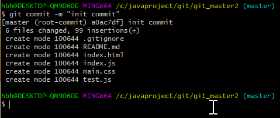
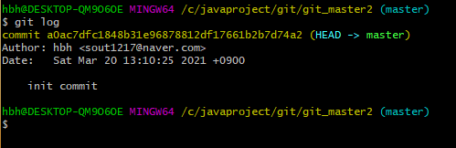
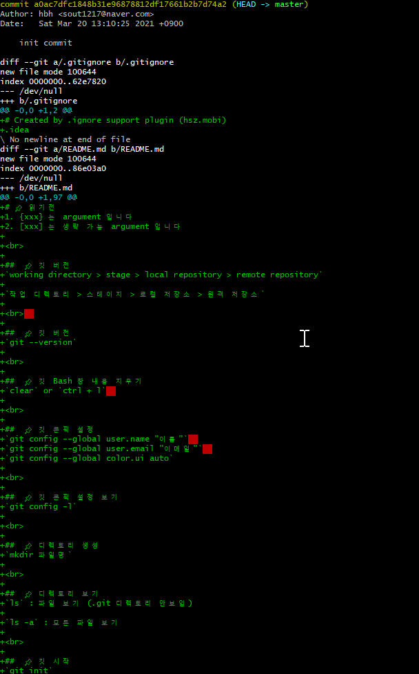
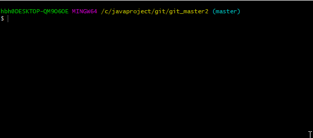
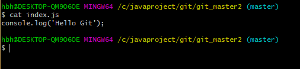
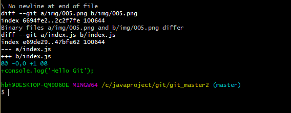
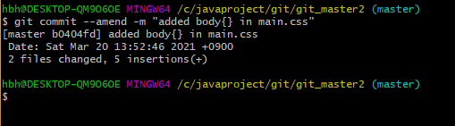
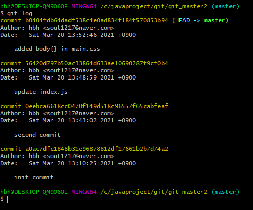
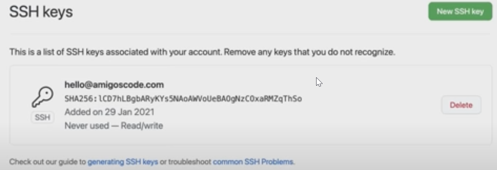
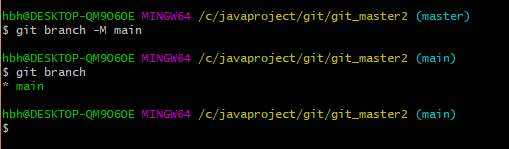

# 📌 읽기전
1. {xxx} 는 argument 입니다
2. [xxx] 는 생략 가능 argument 입니다

 

## 📌 깃 관리 영역
`working directory > stage > local repository > remote repository`

`작업 디렉토리 > 스테이지 > 로컬 저장소 > 원격 저장소`

   

##  📌 깃 버전 보기
`git --version`

 

## 📌 깃 Bash 창 내용 지우기
`clear` or `ctrl + l`  

 

## 📌 깃 콘픽 설정 하기
`git config --global user.name "이름"`  
`git config --global user.email "이메일"`  
`git config --global color.ui auto`

 

## 📌 깃 콘픽 설정 보기
`git config -l`

 

## 📌 디렉토리 생성
`mkdir 파일명`

 

## 📌 디렉토리 보기
`ls` : 파일 보기 (.git 디렉토리 안보임)

`ls -a` : 모든 파일 보기

 

## 📌 깃 시작 하기
`git init`

 

## 📌 깃 제거 하기
`rm -rf .git`

`rm -rf {파일 또는 디렉토리}` : 묻지 않고 바로 제거

 

## 📌 파일 생성 하기
`touch {파일명}`

 ex) `touch index.html`

 

## 📌 깃 현재 상태 보기
`git status` : branch, untracked,  new file, modified, deleted 등 정보를 알 수 있다

`branch` : 브랜치 정보  
`untracked` : `working directory` 에 있는 파일 (한 번도 `add` 가 되지 않은 파일)  
`new file` : `working directory` 에서 `add` 를 통행 `stage` 로 넘어온 파일  
`modified` : 한 번 `commit` 되고 나서 수정 된 경우  
`deleted` : `stage` 또는 `local repository` 에서 삭제된 경우

 

## 📌 깃 추가하기 <small>working directory -> stage</small>
`git add {파일명}` : `working directory` 의 해당 파일을 `stage` 에 이동

`git add .` : 현재 디렉토리의 `working directory` 의 파일을 모두 `stage` 에 이동

`git add -A` or `git add --all` : `working directory` 의 파일을 모두 `stage` 에 이동

 

## 📌 깃 커밋하기 <small>stage -> local repository</small>
`git commit -m "{메시지}"`

 

`create mode` : 파일이 `local repository` 생성 됨을 알리는 로그

 

## 📌 깃 로그 보기
`git log`

 

`commit a0ac7dfc1848b31e96878812df17661b2b7d74a2`  
: 커밋 해시 (주소번지) - 나중에 돌아갈 때 커밋해시를 통해서 합니다

`Author: hbh <sout1217@naver.com>`  
: 위에서 작성한 `git config --global user.name 과 user.email`  내용으로 작성 됩니다

`init commit`  
: `git commit -m {메시지}` 커밋 메시지 내용입니다

 

## 📌 깃 보기
`git show {커밋해시}`

 

> TIP : 내용이 긴 경우 엔터를 쳐서 확장이 가능하며, 더 이상 안보려면 q 를 누르면 빠져나옵니다

 

## 📌  파일 편집하기
`vi {파일명}` : 파일 에디터 실행

 

> TIP : vi 를 입력 후 `shift + tab` 을 누르시면 파일 목록이 나타납니다

 

`i` : 작성모드  
`esc` : 명령모드  
`[명렴모드] :wq!` : 저장하고 파일 닫기   
`[명렴모드] :q!` : 저장하지 않고 파일 닫기 

 

## 📌 파일 내용 보기
`cat {파일명}` : 파일 내용 보기

 

 

## 📌 이전 커밋과 다른 점 비교하기
`git diff`

 

 
 
 `+console.log('Hello Git')` : + 내용이 추가 됨
 `-console.log('Hello Git')` : - 내용이 삭제 됨

 

## 📌 최근에 커밋된 메시지 내용 수정하기
`git commit --amend [-m] "{메시지}"`

 

 

`git log` 를 이용하여 메시지 내용이 변경된 것을 확인한다

 

## 📌 깃 허브(Git-Hub)에 프로젝트 업로드하기 <small>(local repository -> remote repository)</small>
- 깃 허브 계정이 있어야 가능합니다
- 깃 허브에서 remote repository 생성은 생략합니다 (보통 local repository 에서 remote repository 로 업로드 합니다)

`git remote add origin {깃헙주소}`  
ex) `git remote add origin https://github.com/sout1217/sample.git`

 

`git push -u -origin {마스터명}` : 위 에서 `git remote add` 로 연결한 `remote repository` 에 파일을 업로드 합니다

> TIP : remote repository 에 push 하기 위해서는 `git-hub>SSH and GPG keys>SSH keys>generating SSH keys>Generating a new SSH key and adding it to the ssh-agent>Windows ` 에서 인증을 받아야 합니다  
>
> `ssh-keygen -t ed25519 -C "{이메일}"` 비밀번호는 작성안해도 가능합니다   
> `eval "$(ssh-agent -s)"`  
> `vi ~/.ssh/config`
> `Host * AddKeysToAgent yes UseKeychain yes IdentityFile ~/.ssh/id_ed25519`  
> `ssh-add -K ~/.ssh/id_ed25519`
> `cat ~/.ssh/id_ed25519.pub` : 나오는 키를 복사 `pbcopy < ~/.ssh/id_ed25519.pub` 로 복사 가능
> `git hub > New SSH key` 클릭 후 `id_ed25519.pub` 키를 붙여넣기

  

## 📌 깃 마스터 브랜치명 변경 및 브랜치 리스트 조회하기
`git branch -M {마스터명}` : 마스터명을 바꿉니다

`git branch` : 현재 존재하는 브랜치 목록들을 보여줍니다 

